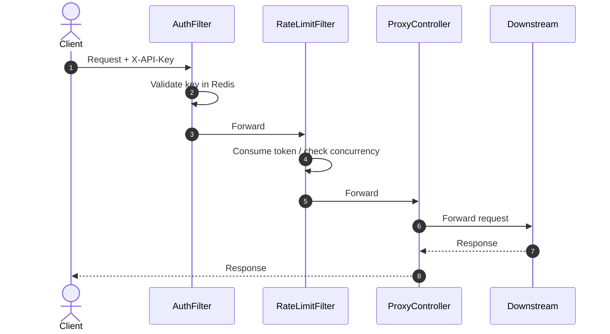
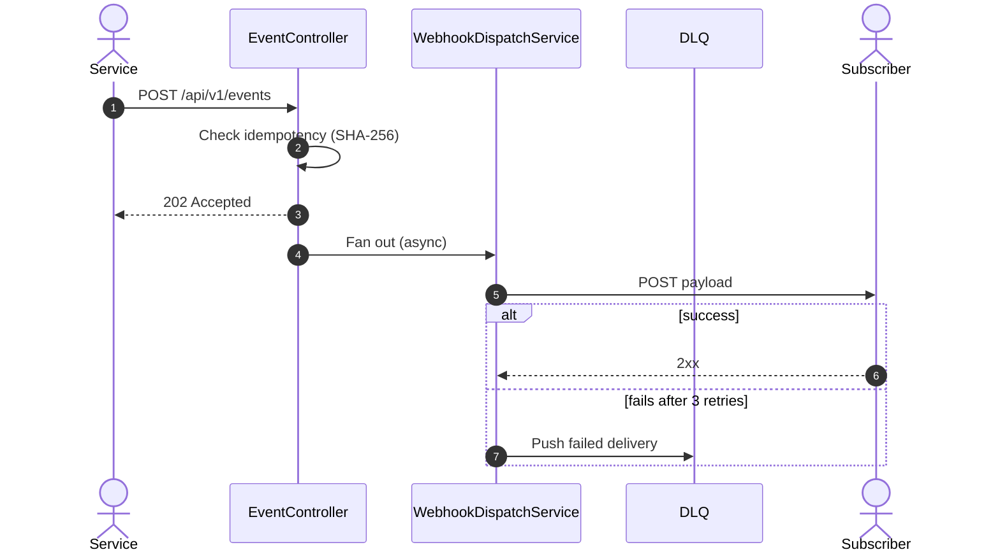

# SentinelPulse

[](https://openjdk.org/projects/jdk/21/)
[](https://spring.io/projects/spring-boot)
[](https://redis.io/)
[](https://maven.apache.org/)
[](https://prometheus.io/)
[](https://grafana.com/)

A small API gateway written in Java/Spring Boot that sits in front of a set of backend services. It handles API-key authentication, per-client rate limiting, request proxying, and asynchronous webhook delivery with retries and a dead-letter queue. Built as a learning project to practice gateway patterns, Redis-backed state, and observability with Prometheus/Grafana.

---

## What it does

- **Authenticates** incoming requests via an `X-API-Key` header, checked against Redis.
- **Rate limits** each client using a token-bucket algorithm, and separately **throttles** concurrent in-flight requests per client and globally.
- **Proxies** requests to backend services based on route definitions stored in Redis (seeded from `routes.json` on startup).
- **Accepts events** via `POST /api/v1/events`, deduplicates them (SHA-256 idempotency check), and **fans them out** to subscribed webhook endpoints on a background thread pool.
- **Retries failed webhook deliveries** with exponential backoff (2s → 4s → 8s), and pushes permanently failed deliveries to a Redis dead-letter queue.
- **Exposes metrics** via Micrometer/`/actuator/prometheus` for scraping by Prometheus, visualized in Grafana.

## What it doesn't do

- It's not a production-grade edge gateway — no TLS termination, no multi-instance/HA setup, no distributed rate-limit coordination beyond a single Redis instance.
- The default API key is seeded in plaintext config for local development. Don't reuse this setup as-is for anything internet-facing.
- No load testing has been done, so there are no latency/throughput numbers here — the architecture is designed for low overhead (in-memory route cache, non-blocking I/O for proxying), but that's a design intent, not a benchmark result.
- The dead-letter queue reduces the chance of losing failed webhook events, but it isn't a durability guarantee — if Redis isn't configured with persistence, queued data can be lost on restart.

---

## Architecture





## Request flow

1. **AuthFilter** — validates `X-API-Key` against Redis. Fails with `401` if missing or invalid.
2. **RateLimitFilter** — consumes a token from the client's rate-limit bucket, then checks in-flight concurrency limits. Fails with `429` on either breach.
3. **ProxyController** — resolves the target URL from the route table and forwards the request, adding `X-Forwarded-For`, `X-Request-ID`, and `X-Gateway-Time` headers.
4. **EventController** (separate path) — accepts webhook events, checks for duplicates, and hands off delivery to a background worker pool so the caller isn't blocked by retries.

---

## Tech stack

| Component | Choice |
|---|---|
| Language / Runtime | Java 21 |
| Framework | Spring Boot 3.x (Web, WebFlux for outbound calls, Actuator) |
| State store | Redis (via Lettuce) |
| Metrics | Micrometer → Prometheus |
| Dashboards | Grafana |
| Build | Maven |

## API

| Method | Endpoint | Purpose | Success | Failure |
|---|---|---|---|---|
| `POST` | `/api/v1/subscribers` | Register a webhook subscriber | `201` | `400` |
| `POST` | `/api/v1/events` | Submit an event for delivery | `202` | `400`, `409` (duplicate) |
| `*` | `/**` | Proxied to the matching backend route | `2xx` (proxied) | `401`, `429`, `404`, `502` |
| `GET` | `/actuator/health` | Health check | `200` | — |
| `GET` | `/actuator/prometheus` | Metrics scrape endpoint | `200` | — |

## Redis keys

| Key | Type | Contents | TTL |
|---|---|---|---|
| `apikeys:{key}` | String | `client_id` | none |
| `rate_limit:{client_id}` | Hash | `tokens`, `last_refill`, `capacity`, `refill_rate` | none |
| `route:{path}` | Hash | `target_url`, `methods` | none |
| `subscriber:{id}` | Hash | `subscriber_id`, `target_url`, `event_type` | none |
| `subscribers:index` | Set | subscriber IDs | none |
| `idempotency:{sha256}` | String | `"1"` | 24h |
| `dlq:webhooks` | List | failed delivery records (JSON) | none |

## Metrics exported

| Metric | Type | Meaning |
|---|---|---|
| `sentinelpulse_requests_total` | Counter | Total inbound requests |
| `sentinelpulse_requests_rejected_auth` | Counter | Requests rejected by auth |
| `sentinelpulse_requests_rejected_ratelimit` | Counter | Requests rejected by rate limiter |
| `sentinelpulse_proxy_latency_seconds` | Timer | Proxy forwarding duration |
| `sentinelpulse_webhook_dispatched_total` | Counter | Webhook delivery attempts |
| `sentinelpulse_webhook_dispatch_failed` | Counter | Deliveries that exhausted retries |
| `sentinelpulse_dlq_depth` | Gauge | Current DLQ length |

---

## Getting started

### Prerequisites

- Java 21
- Maven
- Redis (running and reachable)
- Prometheus + Grafana (optional — only needed if you want dashboards)

### Configure

Set your Redis connection and defaults in `src/main/resources/application.yml`:

```yaml
spring:
  data:
    redis:
      host: localhost
      port: 6379          # match whatever port your Redis is on
      password: <your-redis-password>

sentinelpulse:
  rate-limit:
    default-capacity: 10
    default-refill-rate: 2
  webhook:
    max-retries: 3
    backoff-base-ms: 2000
  idempotency:
    ttl-seconds: 86400
```

Define your backend routes in `src/main/resources/routes.json`:

```json
[
  {
    "path": "/api/v1/orders",
    "target_url": "http://localhost:9091",
    "methods": ["GET", "POST"]
  }
]
```

### Run

```bash
mvn clean install
mvn spring-boot:run
```

The gateway starts on `http://localhost:8080`. On startup, `RouteSeeder` loads `routes.json` into Redis and seeds a development API key — check the logs for its value, and replace it before using this anywhere beyond your own machine.

### Try it

```bash
# Register a webhook subscriber
curl -X POST http://localhost:8080/api/v1/subscribers \
  -H "Content-Type: application/json" \
  -d '{"subscriber_id": "test-1", "target_url": "http://localhost:9000/hook", "event_type": "order.created"}'

# Send an event
curl -X POST http://localhost:8080/api/v1/events \
  -H "Content-Type: application/json" \
  -d '{"event_type": "order.created", "source": "orders-service", "data": {"order_id": 123}}'

# Proxy a request through to a registered route
curl -H "X-API-Key: <your-dev-key>" http://localhost:8080/api/v1/orders
```

---

## Project structure

```
src/main/java/com/sentinelpulse/
├── SentinelPulseApplication.java
├── config/            # Redis, executor, and WebClient beans
├── filter/            # AuthFilter, RateLimitFilter
├── startup/           # RouteSeeder (loads routes.json into Redis)
├── controller/        # ProxyController, EventController, SubscriberController
├── service/           # Auth, rate limiting, routing, dispatch, idempotency
├── model/              # Request/response DTOs
└── metrics/           # Micrometer registrations
```

---
