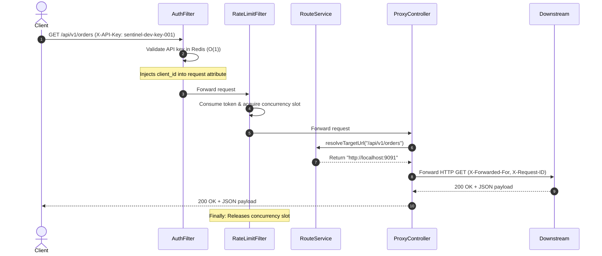
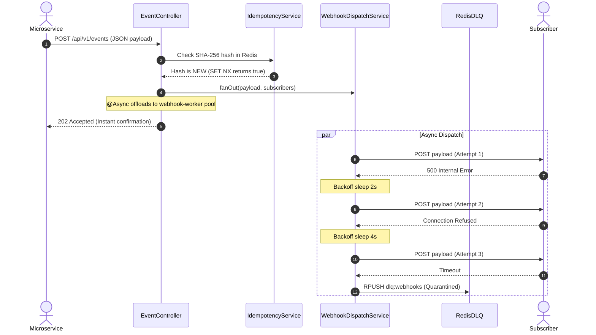

# SentinelPulse — Complete Architecture, Concept & Component Blueprint (`details.md`)

> **Executive Summary:** This document is the authoritative, comprehensive blueprint for **SentinelPulse**. It covers the complete architecture, every core concept, all technical primitives, the full telemetry stack, and every single class and component across the codebase. For every topic, it rigorously answers **WHAT**, **HOW**, **WHY**, **WHEN**, and **WHERE**.

---

## Table of Contents
1. [Archetype & System Philosophy](#1-archetype--system-philosophy)
2. [Architecture Tenets](#2-architecture-tenets)
3. [Core Mechanics (Deep Dive)](#3-core-mechanics-deep-dive)
4. [Technical Primitives & Concurrency Model](#4-technical-primitives--concurrency-model)
5. [API Concepts & HTTP Protocol Contracts](#5-api-concepts--http-protocol-contracts)
6. [Telemetry, Observability & Infrastructure Stack](#6-telemetry-observability--infrastructure-stack)
7. [Comprehensive Component-by-Component Reference](#7-comprehensive-component-by-component-reference)
8. [Redis Data Structures & Complete Schema](#8-redis-data-structures--complete-schema)
9. [End-to-End Request Lifecycles & Sequence Diagrams](#9-end-to-end-request-lifecycles--sequence-diagrams)
10. [Resilience, Fault-Tolerance & Failure Modes](#10-resilience-fault-tolerance--failure-modes)

---

## 1. Archetype & System Philosophy

### Edge Infrastructure
- **WHAT:** The perimeter layer deployed at the network ingress that sits between public or upstream traffic and internal microservices. It intercepts, sanitizes, authenticates, and shapes all traffic before it can penetrate internal services.
- **HOW:** SentinelPulse listens on `http://localhost:8080`. Every incoming TCP connection is accepted by Tomcat NIO worker threads and passed through a chain of non-blocking Spring servlet filters (`AuthFilter` and `RateLimitFilter`) before reaching any endpoint logic.
- **WHY:** Prevents untrusted, malicious, or malformed traffic from reaching downstream business applications. Centralizes authentication, rate limiting, and telemetry in a single edge gateway rather than duplicating security logic across dozens of microservices.
- **WHEN:** Executes on the arrival of every single HTTP request before routing or business execution begins.
- **WHERE:** `com.sentinelpulse.filter.AuthFilter` and `com.sentinelpulse.filter.RateLimitFilter`.

### Reverse Proxy
- **WHAT:** An intermediary server that receives client requests, rewrites headers, routes them to internal private services, and relays responses back to the client.
- **HOW:** `ProxyController` matches incoming paths (`/**`), checks route definitions cached in memory (L1) or Redis (L2), strips hop-by-hop HTTP headers, injects tracing headers (`X-Forwarded-For`, `X-Request-ID`, `X-Gateway-Time`), forwards the request via a non-blocking `WebClient`, and streams the status code and body back.
- **WHY:** Decouples clients from the internal topology, ports, and IP addresses of internal backend microservices. Allows zero-downtime routing changes, transparent load balancing, and unified observability.
- **WHEN:** Triggers whenever an authenticated, rate-compliant request does not match local gateway management routes (`/api/v1/**` and `/actuator/**`).
- **WHERE:** `com.sentinelpulse.controller.ProxyController` and `com.sentinelpulse.service.RouteService`.

### Event-Driven Dispatcher
- **WHAT:** An asynchronous messaging hub that ingests discrete domain events and broadcasts them out to decoupled external HTTP webhooks based on event topic subscriptions.
- **HOW:** Clients submit event payloads to `POST /api/v1/events`. SentinelPulse validates the payload, checks idempotency via SHA-256 fingerprinting, queries Redis for all subscribers registered for `event_type`, hands off the event to a dedicated worker thread pool (`webhookExecutor`), and immediately returns `HTTP 202 Accepted`. Worker threads asynchronously POST the event to all subscribers with retry backoff.
- **WHY:** Decouples event producers (e.g., checkout service, inventory service) from event consumers (e.g., payment gateways, CRM, partner webhooks). Producers never wait for slow external third-party HTTP deliveries.
- **WHEN:** Initiated immediately upon receipt of a valid `POST /api/v1/events` payload.
- **WHERE:** `com.sentinelpulse.controller.EventController` and `com.sentinelpulse.service.WebhookDispatchService`.

---

## 2. Architecture Tenets

### Decoupled
- **WHAT:** Loose architectural coupling where individual components run independently without hard compile-time or runtime dependencies on each other.
- **HOW:**
  1. Route definitions are decoupled from code; they live as Redis Hashes and are dynamic.
  2. Webhook subscribers register dynamically via REST API into Redis sets.
  3. Ingress HTTP threads (`http-nio-8080`) are strictly isolated from webhook dispatch threads (`webhook-worker-`).
- **WHY:** An outage or latency spike in a downstream webhook subscriber will never exhaust the gateway's HTTP worker threads or slow down unrelated proxy traffic.
- **WHEN:** Continuous during startup and runtime.
- **WHERE:** `ExecutorConfig.java`, `RouteSeeder.java`, `WebhookDispatchService.java`.

### High-Throughput
- **WHAT:** Capability to process high request rates with minimal gateway-induced latency ($p50 < 2\text{ms}$).
- **HOW:**
  1. Two-tiered caching: L1 JVM In-Memory cache (`ConcurrentHashMap`) backed by L2 Redis store.
  2. $O(1)$ key lookups for API key validation and subscriber matching.
  3. Non-blocking reactive I/O using Netty-backed `WebClient` for outbound forwarding.
- **WHY:** Edge proxies must not become performance bottlenecks; sub-millisecond gateway processing ensures near-direct downstream performance.
- **WHEN:** Applied to every lookup and outbound transmission.
- **WHERE:** `RouteService.java`, `WebClientConfig.java`, `AuthService.java`.

### Asynchronous
- **WHAT:** Non-blocking processing where long-running workflows are handed off to background queues and threads, freeing the caller immediately.
- **HOW:** In `EventController.java`, once payload schema and idempotency are verified, the method calls `webhookDispatchService.fanOut()` annotated with `@Async("webhookExecutor")` and returns `202 Accepted` in $\approx 2\text{ms}$. Webhook retries and sleep intervals occur solely on the worker pool.
- **WHY:** Retrying a failing webhook with exponential backoff (2s + 4s + 8s) can take over 14 seconds. Blocking the client for 14 seconds would cause timeouts and connection exhaustion.
- **WHEN:** Webhook event ingestion (`POST /api/v1/events`).
- **WHERE:** `EventController.java`, `WebhookDispatchService.java`, `ExecutorConfig.java`.

### Fault-Tolerant
- **WHAT:** Resilience under network instability, database restarts, or downstream microservice outages without crashes or data loss.
- **HOW:**
  1. Downstream outages do not throw uncaught 500 exceptions; they are caught and mapped to `502 Bad Gateway`.
  2. Redis Lettuce client configured with `autoReconnect=true` and explicit socket timeouts.
  3. Webhooks retry up to 3 times with exponential backoff.
  4. Permanently dead webhooks are quarantined in a Redis Dead-Letter Queue (DLQ).
- **WHY:** Systems operate in hostile network environments; a reliable gateway must degrade gracefully and guarantee zero data loss.
- **WHEN:** Whenever an outbound I/O fails or times out.
- **WHERE:** `ProxyController.java`, `WebhookDispatchService.java`, `RedisConfig.java`.

---

## 3. Core Mechanics (Deep Dive)

### Token-Bucket Rate Limiting
- **WHAT:** Rate-limiting algorithm that maintains a "bucket" of tokens. Each request consumes 1 token. Tokens refill over time at a fixed rate up to a maximum capacity.
- **HOW:** Stored in Redis under `rate_limit:{client_id}` with fields `tokens`, `last_refill`, `capacity`, and `refill_rate`. On every request:
  $$\text{elapsed\_sec} = \text{now} - \text{last\_refill}$$
  $$\text{new\_tokens} = \min(\text{capacity}, \text{tokens} + \text{elapsed\_sec} \times \text{refill\_rate})$$
  If $\text{new\_tokens} \ge 1$, decrement by 1, update Redis, and allow request. If $\text{new\_tokens} < 1$, reject with `429 Too Many Requests` and header `Retry-After: 10`.
- **WHY:** Accommodates bursty traffic (up to the bucket capacity) while enforcing a strict sustained throughput limit over time.
- **WHEN:** Evaluated on every authenticated request inside `RateLimitFilter`.
- **WHERE:** `com.sentinelpulse.service.RateLimitService` and `com.sentinelpulse.filter.RateLimitFilter`.

### Throttling (In-Flight Concurrency Limiting)
- **WHAT:** Limits the number of simultaneous, concurrent requests being processed by the server or by a specific client at any single instant.
- **HOW:** Maintained in memory via `AtomicInteger` counters:
  - Global In-Flight limit: `100` concurrent requests.
  - Per-Client In-Flight limit: `15` concurrent requests.
  `tryAcquire(clientId)` atomically increments counters. If either exceeds its threshold, it immediately decrements and returns `false` (triggering HTTP 429 with `X-Throttled: true`). When the request completes, `release(clientId)` is executed inside a `finally` block.
- **WHY:** Rate limiting governs total volume over time (e.g. 10 req/min). Throttling governs concurrency *at this exact instant*. If 50 requests arrive in the exact same millisecond, rate limiting might allow them, but processing all 50 concurrently could exhaust Tomcat threads and collapse downstream services. Throttling prevents concurrency starvation.
- **WHEN:** Evaluated on every request immediately after rate-limit token consumption.
- **WHERE:** `com.sentinelpulse.service.ThrottlingService` and `RateLimitFilter.java`.

### Webhook Broadcasting (Fan-Out)
- **WHAT:** Distributing an inbound event to multiple registered recipient endpoints that subscribed to that event's topic.
- **HOW:** In `EventController`, `subscriberService.findByEventType(payload.getEventType())` queries the `subscribers:index` Redis set and retrieves each matching subscriber hash. `WebhookDispatchService.fanOut()` iterates over all matched endpoints and delivers payloads asynchronously.
- **WHY:** Producers publish an event once without having to know or manage the addresses of 10 different recipient services.
- **WHEN:** Executed upon event acceptance.
- **WHERE:** `SubscriberService.java` and `WebhookDispatchService.java`.

### Exponential Backoff
- **WHAT:** An algorithm that progressively doubles the wait time between successive delivery retries.
- **HOW:** For each failed webhook attempt:
  $$\text{wait\_time} = \text{base\_ms} \times 2^{\text{attempt} - 1}$$
  With $\text{base\_ms} = 2000$:
  - Attempt 1: Immediate delivery
  - Attempt 2: After 2,000ms ($2\text{s}$)
  - Attempt 3: After 4,000ms ($4\text{s}$)
  - Attempt 4: After 8,000ms ($8\text{s}$)
- **WHY:** When a downstream subscriber server crashes or restarts, bombarding it immediately with retries causes a "thundering herd" effect that keeps it down. Exponential backoff gives the receiver time to recover.
- **WHEN:** Executed on any non-2xx HTTP response or connection timeout during webhook delivery.
- **WHERE:** `WebhookDispatchService.java:108-121`.

### Dead-Letter Queues (DLQ)
- **WHAT:** A quarantine list for event payloads that failed delivery across all configured retry attempts.
- **HOW:** When attempt 3 fails, `WebhookDispatchService.pushToDlq()` builds a JSON document containing `delivery_id`, `subscriber_id`, `target_url`, `event_type`, `failed_at`, `attempts: 3`, and the original `raw_payload`. It pushes this record using `RPUSH dlq:webhooks`.
- **WHY:** Guarantees zero data loss. Poison pills or long-term downstream outages do not vanish into the void; operators can inspect, alert, and re-drive them from RedisInsight.
- **WHEN:** Triggered after the 3rd failed retry attempt.
- **WHERE:** `WebhookDispatchService.java:184-219`.

### Idempotency Enforcement
- **WHAT:** Guarantee that repeated receipt of the exact same event payload produces only one execution.
- **HOW:** Calculates the cryptographic SHA-256 hash of the raw HTTP request body bytes:
  $$\text{hash} = \text{SHA-256}(\text{rawBodyBytes})$$
  Executes an atomic Redis operation:
  $$\text{SET idempotency:\{hash\} "1" EX 86400 NX}$$
  If Redis returns `TRUE`: Key was set $\rightarrow$ Payload is new $\rightarrow$ Proceed.
  If Redis returns `FALSE`: Key already exists $\rightarrow$ Duplicate detected $\rightarrow$ Return `HTTP 409 Conflict`.
- **WHY:** Network retries from upstream clients or microservices frequently re-send the same event. Without idempotency, users would receive duplicate billing, duplicate order confirmations, or duplicate inventory deductions.
- **WHEN:** Executed before subscriber lookup or dispatch in `EventController`.
- **WHERE:** `com.sentinelpulse.service.IdempotencyService`.

### Route Caching
- **WHAT:** High-performance in-memory caching of route targets in the JVM.
- **HOW:** Implemented via `ConcurrentHashMap<String, CachedRoute>` with a 60-second TTL. On incoming requests:
  1. Check L1 memory cache. If present and $\le 60\text{s}$ old, return target URL immediately ($<50\text{ns}$).
  2. If miss or expired, query Redis Hash `route:{path}` ($1-2\text{ms}$), update L1 cache, and return.
  3. `RouteSeeder` invalidates the L1 cache on application startup or when routes are reloaded.
- **WHY:** Eliminates 1,000s of redundant Redis network roundtrips per second under heavy traffic loads.
- **WHEN:** Evaluated on every reverse proxy lookup in `ProxyController`.
- **WHERE:** `com.sentinelpulse.service.RouteService`.

---

## 4. Technical Primitives & Concurrency Model

### Concurrency
- **WHAT:** The concurrent execution of multiple independent execution contexts across hardware CPU threads.
- **HOW:** SentinelPulse uses a decoupled dual-tier concurrency model:
  - Ingress Tier: Tomcat NIO thread pool (`http-nio-8080-exec-*`) handles incoming HTTP client connections.
  - Dispatch Tier: Spring `ThreadPoolTaskExecutor` (`webhook-worker-*`) handles outbound async webhook deliveries.
- **WHY:** Webhook network latency and backoff sleeps will never consume Tomcat ingress threads.
- **WHERE:** `ExecutorConfig.java`, `application.yml`.

### Thread-Safety
- **WHAT:** Ensuring code operates correctly and deterministically when accessed simultaneously by multiple threads without data races or corruption.
- **HOW:**
  - All Spring Controllers and Filters are stateless singletons.
  - State maps use thread-safe `ConcurrentHashMap`.
  - Concurrency counters use lock-free `AtomicInteger`.
  - Redis commands use atomic primitives (`SET NX`, `HSET`, `RPUSH`).
- **WHERE:** `RateLimitService.java`, `ThrottlingService.java`, `RouteService.java`.

### ExecutorService
- **WHAT:** Standard Java concurrency management abstraction (`java.util.concurrent.ExecutorService`) managing pooled worker threads.
- **HOW:** Configured in `ExecutorConfig.java` as a `ThreadPoolTaskExecutor`:
  - `core-pool-size`: 10 (threads always ready)
  - `max-pool-size`: 50 (burst capacity)
  - `queue-capacity`: 200 (buffer for pending dispatches)
  - `RejectedExecutionHandler`: `CallerRunsPolicy` (never drops tasks silently)
  - `waitForTasksToCompleteOnShutdown`: true (graceful drain up to 30 seconds)
- **WHERE:** `com.sentinelpulse.config.ExecutorConfig`.

### AtomicInteger
- **WHAT:** Hardware-supported atomic integer primitive utilizing lock-free Compare-And-Swap (CAS) instructions.
- **HOW:**
  - In `RateLimitService`: Used as a lightweight spin-wait CAS mutex (`compareAndSet(0, 1)`) per client to serialize token refills without global lock contention.
  - In `ThrottlingService`: Used for lock-free atomic increment (`incrementAndGet()`) and rollback decrement (`decrementAndGet()`) for tracking active in-flight requests.
- **WHERE:** `RateLimitService.java:78-95` and `ThrottlingService.java:66-105`.

---

## 5. API Concepts & HTTP Protocol Contracts

### API Gateway
- **WHAT:** The unified public entry point that provides routing, protocol abstraction, rate limiting, and security for backend microservices.
- **HOW:** Combines `AuthFilter`, `RateLimitFilter`, `ProxyController`, and `SubscriberController` into an integrated gateway pipeline.

### Microservices
- **WHAT:** An architecture where business capabilities are partitioned into independent services.
- **HOW:** SentinelPulse provides dynamic proxy routing for:
  - Orders Service (`/api/v1/orders` $\rightarrow$ `http://localhost:9091`)
  - Inventory Service (`/api/v1/inventory` $\rightarrow$ `http://localhost:9092`)
  - Payments Service (`/api/v1/payments` $\rightarrow$ `http://localhost:9093`)
  - Notifications Service (`/api/v1/notifications` $\rightarrow$ `http://localhost:9094`)

### Webhooks
- **WHAT:** HTTP POST callbacks triggered by domain events.
- **HOW:** Subscribers register via `POST /api/v1/subscribers`. SentinelPulse fires outbound POST requests with headers:
  - `Content-Type: application/json`
  - `X-SentinelPulse-Event: <event_type>`
  - `X-SentinelPulse-Delivery: <uuid>`

### Status Codes Reference Matrix
| Status Code | Meaning | When SentinelPulse Emits This | Source Component |
| :--- | :--- | :--- | :--- |
| `200 OK` | Success | Existing subscriber updated; Health check OK; Downstream 200 forwarded. | `SubscriberController`, `ProxyController`, Actuator |
| `201 Created` | Created | Brand new webhook subscriber registered in Redis. | `SubscriberController.java` |
| `202 Accepted` | Accepted | Webhook event accepted for background async delivery. | `EventController.java` |
| `400 Bad Request` | Bad Request | Malformed JSON body; missing required fields; illegal URL scheme. | `EventController`, `SubscriberController`, `ProxyController` |
| `401 Unauthorized` | Unauthorized | Missing `X-API-Key` or API key not found in Redis. | `AuthFilter.java` |
| `404 Not Found` | Not Found | Route has no mapping in Redis; or event has 0 subscribers. | `ProxyController.java`, `EventController.java` |
| `405 Method Not Allowed` | Method Forbidden | HTTP method not permitted in route's `methods` list. | `ProxyController.java` |
| `409 Conflict` | Conflict | Duplicate event payload detected within 24h window (Idempotency). | `EventController.java` |
| `429 Too Many Requests` | Rate Limited / Throttled | Token bucket empty; or concurrent in-flight limit exceeded. | `RateLimitFilter.java` |
| `502 Bad Gateway` | Downstream Offline | Target downstream microservice unreachable or refused connection. | `ProxyController.java` |

---

## 6. Telemetry, Observability & Infrastructure Stack

### Java 21/25 & Spring Boot 3.3.4
- Runs on modern LTS JVM. Employs modern Java records (`CachedRoute`), virtual thread compatibility, and Spring Boot autoconfiguration.

### Redis-Stack (`MACHAREDIS`)
- Container: `redis/redis-stack:latest`
- Ports:
  - `6000`: Redis Server (configured in `application.yml` via `spring.data.redis.port: 6000`)
  - `8000`: RedisInsight Web GUI (`http://localhost:8000`)
- Role: Authoritative storage for API keys, rate limit buckets, routes, subscriber registrations, idempotency hashes, and DLQ.

### Prometheus (`MACHAPROMETHEUS`)
- Container: `prom/prometheus:latest`
- Port: `9000` (mapped to internal `9090`)
- Role: Scrapes `http://host.docker.internal:8080/actuator/prometheus` every 3 seconds.

### Grafana (`MACHAGRAFANA`)
- Container: `grafana/grafana:latest`
- Port: `2500` (mapped to internal `3000`)
- Role: Visualizes dashboards for throughput, proxy latency percentiles (p50, p95, p99), active threads, and DLQ depth.

### SLF4J & Logback
- Configured via `logback-spring.xml` with color-coded console logs and rolling log files at `logs/sentinelpulse.log`.

---

## 7. Comprehensive Component-by-Component Reference

### 1. `SentinelPulseApplication.java`
- **WHAT:** Main Spring Boot startup application class.
- **HOW:** Contains `@SpringBootApplication` and `@EnableAsync`.
- **WHY:** `@EnableAsync` is mandatory to activate Spring's async method proxying for `@Async("webhookExecutor")`. Without it, async annotations are ignored and run on the caller thread.
- **WHEN:** Executed at JVM launch.
- **WHERE:** `src/main/java/com/sentinelpulse/SentinelPulseApplication.java`.

### 2. `ExecutorConfig.java`
- **WHAT:** Spring configuration declaring the dedicated webhook thread pool.
- **HOW:** Defines `ThreadPoolTaskExecutor` bean named `webhookExecutor` with `corePoolSize=10`, `maxPoolSize=50`, `queueCapacity=200`, and `CallerRunsPolicy`.
- **WHY:** Isolates outbound webhook network operations from incoming request threads.
- **WHEN:** Initialized during Spring context creation.
- **WHERE:** `src/main/java/com/sentinelpulse/config/ExecutorConfig.java`.

### 3. `RedisConfig.java`
- **WHAT:** Configures Lettuce connection factory and string serializers for Redis.
- **HOW:** Connects to port 6000 with socket timeout of 2 seconds. Configures `StringRedisSerializer` for keys and values.
- **WHY:** Guarantees all data in Redis is stored as human-readable UTF-8 strings for inspection in RedisInsight.
- **WHEN:** Initialized during Spring context creation.
- **WHERE:** `src/main/java/com/sentinelpulse/config/RedisConfig.java`.

### 4. `WebClientConfig.java`
- **WHAT:** Configures Netty reactive HTTP clients for proxying and webhooks.
- **HOW:** Exposes `proxyWebClient` (connect: 3s, response: 10s) and `webhookWebClient` (connect: 5s, response: 15s).
- **WHY:** Non-blocking reactive I/O ensures the gateway handles thousands of connections without thread starvation.
- **WHEN:** Initialized on startup.
- **WHERE:** `src/main/java/com/sentinelpulse/config/WebClientConfig.java`.

### 5. `AuthFilter.java`
- **WHAT:** First filter in the chain (`@Order(1)`). Validates `X-API-Key` and attaches security headers.
- **HOW:** Extracts header, checks with `AuthService.isValidApiKey()`. On failure: returns 401. On success: injects `client_id` request attribute and passes downstream.
- **WHY:** Stops unauthorized requests immediately before rate limit tokens are consumed.
- **WHEN:** Runs on every incoming HTTP request (except `/actuator/**`).
- **WHERE:** `src/main/java/com/sentinelpulse/filter/AuthFilter.java`.

### 6. `RateLimitFilter.java`
- **WHAT:** Second filter in the chain (`@Order(2)`). Enforces Token-Bucket rate limiting and in-flight concurrency throttling.
- **HOW:** Consumes token via `rateLimitService.tryConsume(clientId)`. Then acquires slot via `throttlingService.tryAcquire(clientId)`. Releases slot in `finally` block.
- **WHY:** Protects internal services from burst floods and concurrency exhaustion.
- **WHEN:** Runs immediately after `AuthFilter`.
- **WHERE:** `src/main/java/com/sentinelpulse/filter/RateLimitFilter.java`.

### 7. `ProxyController.java`
- **WHAT:** Transparent HTTP reverse proxy handling `/**`.
- **HOW:** Looks up target URL from `RouteService`, filters hop-by-hop headers, adds trace headers, calls downstream via `proxyWebClient`, and measures latency via Micrometer `Timer`.
- **WHY:** Transparently bridges clients to private backend microservices.
- **WHEN:** Handles any path not claimed by local controllers.
- **WHERE:** `src/main/java/com/sentinelpulse/controller/ProxyController.java`.

### 8. `EventController.java`
- **WHAT:** REST controller for webhook ingestion at `POST /api/v1/events`.
- **HOW:** Validates payload, verifies idempotency SHA-256 in Redis, finds subscribers, triggers async fan-out, and returns `202 Accepted`.
- **WHY:** Provides high-speed asynchronous event ingestion.
- **WHEN:** Ingests domain events from microservices.
- **WHERE:** `src/main/java/com/sentinelpulse/controller/EventController.java`.

### 9. `SubscriberController.java`
- **WHAT:** REST controller for subscriber registration at `POST /api/v1/subscribers`.
- **HOW:** Validates input, verifies URL protocol (`http`/`https`), saves to Redis hash and index set. Returns 201 for new, 200 for update.
- **WHY:** Enables dynamic subscriber management without restarting the gateway.
- **WHEN:** Webhook receivers register or update their URLs.
- **WHERE:** `src/main/java/com/sentinelpulse/controller/SubscriberController.java`.

### 10. `AuthService.java`
- **WHAT:** Service that validates API keys.
- **HOW:** Queries Redis key `apikeys:{apiKey}` for mapped `client_id`.
- **WHY:** Single $O(1)$ lookup guarantees instant validation.
- **WHEN:** Called by `AuthFilter`.
- **WHERE:** `src/main/java/com/sentinelpulse/service/AuthService.java`.

### 11. `RateLimitService.java`
- **WHAT:** Implements the Redis-backed Token-Bucket algorithm.
- **HOW:** Uses Redis Hash `rate_limit:{clientId}` with AtomicInteger spin-wait CAS guard to prevent double-spending.
- **WHY:** Enforces per-client sustained traffic limits with burst allowance.
- **WHEN:** Called by `RateLimitFilter`.
- **WHERE:** `src/main/java/com/sentinelpulse/service/RateLimitService.java`.

### 12. `ThrottlingService.java`
- **WHAT:** Manages active in-flight concurrency limits.
- **HOW:** Uses global `AtomicInteger` (limit 100) and `ConcurrentHashMap<String, AtomicInteger>` (limit 15 per client).
- **WHY:** Prevents thread pool exhaustion from simultaneous slow requests.
- **WHEN:** Called by `RateLimitFilter`.
- **WHERE:** `src/main/java/com/sentinelpulse/service/ThrottlingService.java`.

### 13. `RouteService.java`
- **WHAT:** Resolves downstream target URLs and checks allowed HTTP methods.
- **HOW:** Checks L1 JVM cache (`ConcurrentHashMap`), falls back to Redis Hash `route:{path}` with prefix fallback.
- **WHY:** Sub-microsecond route resolution.
- **WHEN:** Called by `ProxyController`.
- **WHERE:** `src/main/java/com/sentinelpulse/service/RouteService.java`.

### 14. `SubscriberService.java`
- **WHAT:** Manages subscriber storage in Redis.
- **HOW:** Writes `subscriber:{id}` hash and adds ID to `subscribers:index` set. Queries matching subscribers by event type.
- **WHY:** Decouples subscriber persistence from event controllers.
- **WHEN:** Called by `SubscriberController` and `EventController`.
- **WHERE:** `src/main/java/com/sentinelpulse/service/SubscriberService.java`.

### 15. `WebhookDispatchService.java`
- **WHAT:** Asynchronously delivers webhooks with exponential backoff and DLQ push.
- **HOW:** Runs on `webhookExecutor`. Retries up to 3 times (2s, 4s, 8s). On final failure, serializes payload to `dlq:webhooks` via `RPUSH`.
- **WHY:** Ensures resilient delivery and zero message loss.
- **WHEN:** Called by `EventController`.
- **WHERE:** `src/main/java/com/sentinelpulse/service/WebhookDispatchService.java`.

### 16. `IdempotencyService.java`
- **WHAT:** Deduplicates event payloads using SHA-256 fingerprints.
- **HOW:** Computes SHA-256 of raw body, executes `SET idempotency:{hash} 1 EX 86400 NX`.
- **WHY:** Prevents duplicate operations from network retries.
- **WHEN:** Called by `EventController`.
- **WHERE:** `src/main/java/com/sentinelpulse/service/IdempotencyService.java`.

### 17. `RouteSeeder.java`
- **WHAT:** Spring `ApplicationRunner` that seeds routes and default API key on startup.
- **HOW:** Reads `routes.json`, writes to Redis hashes `route:{path}`, invalidates L1 cache, seeds `sentinel-dev-key-001`.
- **WHY:** Automates zero-configuration startup and keeps Redis aligned with configuration.
- **WHEN:** Runs once during application bootstrap.
- **WHERE:** `src/main/java/com/sentinelpulse/startup/RouteSeeder.java`.

### 18. `SentinelMetrics.java`
- **WHAT:** Centralized Micrometer metrics registry.
- **HOW:** Registers counters (`requests_total`, `rejected_auth`, `rejected_ratelimit`, `webhook_dispatched_total`), timers (`proxy_latency_seconds`), and gauges (`dlq_depth`, `active_webhook_threads`).
- **WHY:** Provides deep telemetry for Prometheus and Grafana dashboards.
- **WHEN:** Updated continuously during request lifecycles.
- **WHERE:** `src/main/java/com/sentinelpulse/metrics/SentinelMetrics.java`.

### 19. `EventPayload.java`
- **WHAT:** Jackson model for inbound event JSON.
- **HOW:** Maps `event_type`, `source`, `data` map, and captures extra fields via `@JsonAnySetter`.
- **WHY:** Decoupled representation of domain events.
- **WHERE:** `src/main/java/com/sentinelpulse/model/EventPayload.java`.

### 20. `RouteDefinition.java`
- **WHAT:** Model for route definitions loaded from `routes.json`.
- **HOW:** Maps `path`, `target_url`, and `methods` list.
- **WHERE:** `src/main/java/com/sentinelpulse/model/RouteDefinition.java`.

### 21. `SubscriberRequest.java`
- **WHAT:** Model for subscriber registration requests.
- **HOW:** Maps `subscriber_id`, `target_url`, and `event_type`.
- **WHERE:** `src/main/java/com/sentinelpulse/model/SubscriberRequest.java`.

---

## 8. Redis Data Structures & Complete Schema

| Redis Key Pattern | Data Type | Schema / Fields | TTL | Purpose |
| :--- | :--- | :--- | :--- | :--- |
| `apikeys:{key}` | String | Value: `{client_id}` (e.g., `dev-client-001`) | Permanent | Authenticates incoming `X-API-Key` headers in $O(1)$. |
| `rate_limit:{client_id}` | Hash | `tokens` (int), `last_refill` (epoch sec), `capacity` (int), `refill_rate` (int) | Permanent | Authoritative token-bucket state per client. |
| `route:{path}` | Hash | `target_url` (string), `methods` (comma-separated string) | Permanent | Route forwarding destination and allowed HTTP methods. |
| `subscriber:{id}` | Hash | `subscriber_id` (string), `target_url` (string), `event_type` (string) | Permanent | Webhook endpoint registration record. |
| `subscribers:index` | Set | Members: `{subscriber_id}` strings | Permanent | Index of all active subscriber IDs for fast iteration. |
| `idempotency:{hash}` | String | Value: `"1"` | 86,400s (24h) | Marks SHA-256 payload hash as processed. |
| `dlq:webhooks` | List | JSON objects containing delivery failure metadata | Permanent | Dead-Letter Queue for exhausted webhook deliveries. |

---

## 9. End-to-End Request Lifecycles & Sequence Diagrams

### Flow 1: Transparent Reverse Proxy Request

### Flow 2: Webhook Event Ingestion & Async Fan-Out

---

## 10. Resilience, Fault-Tolerance & Failure Modes

1. **Downstream Microservice Offline:**
   - Instead of throwing uncaught 500 exceptions, `ProxyController` catches `WebClientRequestException` and safely responds with `HTTP 502 Bad Gateway` and a structured error body.
2. **Burst DDOS or Connection Flood:**
   - First guarded by `RateLimitFilter` (Token Bucket returns `429 Too Many Requests` with `Retry-After: 10`).
   - Second guarded by `ThrottlingService` (In-Flight Concurrency counter returns `429 Too Many Requests` with `X-Throttled: true`).
3. **Poison Pill Webhook Endpoints:**
   - If a subscriber endpoint is permanently dead or throws 500s, `WebhookDispatchService` isolates the retries on the worker pool. After 3 attempts, it quarantines the event in `dlq:webhooks` and increments `sentinelpulse_webhook_dispatch_failed`.
4. **Duplicate Payload Flood:**
   - Network retries sending identical payloads are caught in sub-millisecond time by `IdempotencyService` via atomic Redis `SET NX`, returning `409 Conflict` without triggering duplicate fan-out.
5. **Redis Temporary Outage:**
   - Lettuce connection factory handles automatic reconnection. Hot routes remain served from the L1 In-Memory Cache for up to 60 seconds without interruption.
